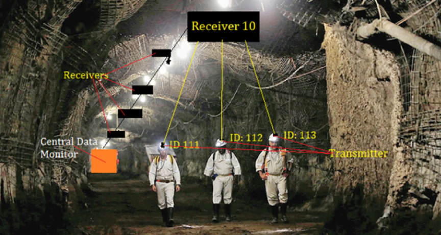
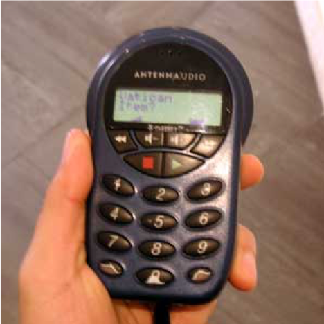
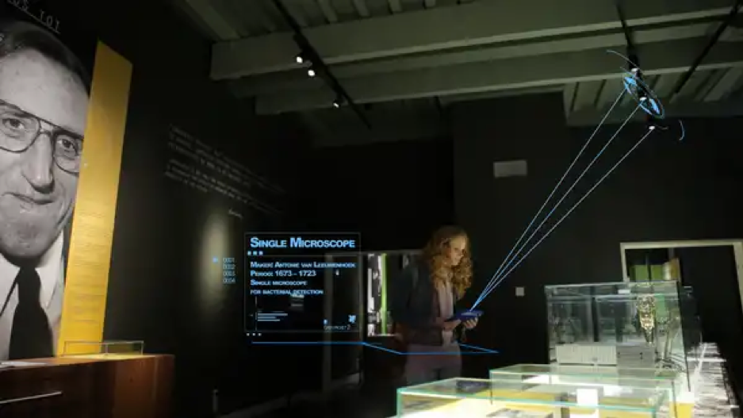

# Project-Team-30

Student Names: Sharwari Phadnis, Akash Alurkar, Aniket Deshpande, Rajas Tulpule

Project Title :
**Data Transmission through Light (Li-Fi)**   - APPROVED
comment: which use case will you use to demonstrate this technology implementation? Has to be a practical one that is easy to understand and consume. 

Project description

Li-Fi can be considered as a light-based Wi-Fi. It uses light instead of radio waves to transmit information. Li-Fi is transmission of data using illumination i.e. sending data through an LED lamp that varies intensity of light faster than what human eye can perceive. The merits of Li-fi to that of Wi-fi are that High data transmission rates of up to 10Gbps can be achieved, since light cannot penetrate walls, it provides privacy and security that Wi-Fi cannot, Li-Fi has low implementation and maintenance costs and unlike Wi-Fi, Li-Fi emits no radiation.

We propose a system which contains a combination of multiple Light emitting diode and a photovoltaic cell which will be used to transmit and receive data respectively. As Li-Fi works in light spectrum bandwidth is greater and the speeds is much larger. Our proposed system aims to send data such as music(sound), pictures, textual data through the light spectrum.

The applications of the system is best suited for indoor large data hungry establishments like colleges, offices, factories and hospitals. Radio waves do not work underwater, Li-Fi do.

------------------------------------------------------------------------------------------------------------------------------

## **LiFi Use Cases**

### **Lighthouse**

Bob works at a deep mineral mine. Mine is very deep and there are very few communication means underground. Mike, the owner of the mine wants to make sure Bob and the other mining workers are safe at all times, and he wants to be able to locate and monitor positions of his workers while they are inside the mine to provide instructions and emergency service in case of a disaster.
    
This is where our Li-Fi product, Lighthouse, comes into the picture. Lighthouse is simply a collection of LightData receivers and transmitters all connected in one central monitoring system. Interconnected LightData receivers will be placed at specific locations in the mine, whereas, LightData transmitters will be placed on the worker's safety hat. And every time a worker passes a receiver a LightData signal containing, that workers unique ID will be transmitted from the worker’s hat to the receiver above. This way central monitoring system can decide the location of the workers based on the latest data collected by the receivers and receiver numbers.

For example, to find the current location of Bob, we will check which was the last receiver bob passed, and that receiver will provide us with the exact location of Bob in the mine.

Lighthouse can save lives by providing each worker’s location, in case of unfortunate mining disasters, via the location and worker data collected by the central monitor, which will further reduce the time taken by emergency services to rescue and help disaster-stuck workers.

------------------------------------------------------------------------------------------------------------------------------

### **Museum Enhanced Experience with Li-Fi**

This use case is specifically aimed to make the museum tour experience more fun and interactive with li-fi for first-time museum goers, children and the elderly to have a superior museum experience. The individual light fixtures at each exhibit deliver information about each individual light exhibit. This positioning grid system with built-in lifi in the light bulbs itself can deliver targeted information to the customer. Here a visitor when visiting a specific exhibit and just point the device at the light source and the audio-visual information about the exhibit is displayed on his device which he rented from the museum. The beauty of this technology is that it will replace the old and drab existing devices to deliver knowledge in the museum. This technology can also be gelled with the new emerging ‘Augmented Reality Museums’2 popping up in the world Using lifi in this use case can provide an energy efficient method for the museums to deliver information right at the user’s fingertips making museum visit a simple, approachable and fun experience rather than just listening to the information.

Here John a visitor rents a device enabled with lifi receiver at the start of the museums. At every exhibit eg ‘Pharohs of Egypt,’ the lights above will be transmitting a recorded information about the exhibit. Now John will just point the device at the light source and the data will be received by the device and start playing the clips in Johns earphones. 

			Existing Audio Guide machines in most museums.
			
			
			
			

			Newer Lifi enabled Museums guides 

------------------------------------------------------------------------------------------------------------------------------

### **LiFi in home automation systems**

Today’s home automation systems form an important constituent of Internet of Things. Home lighting systems, HVAC systems, security systems are a few to name. According to Gartner, by 2022, a typical family home could have more than 500 smart devices.
The #1 concern people have while using these devices is their safety and security. As these devices are connected over the internet, they can be hacked, and vulnerabilities in the firmware that these devices are running can be exploited. Hackers can get into home networks using these vulnerable devices.

LiFi can solve this problem as we can limit the attack surface. The use case we propose is to control all devices in a room using LiFi technology. LiFi is much more secure than traditional WiFi because light, on which LiFi is based, can’t penetrate through walls and doors. We propose to have a LiFi gateway in each room which interfaces with the devices that are present in that room.

With LiFi we intend to solve two problems:

- Security: Devices are more secure, as to take over them, one needs to be physically present inside the house. Unlike Wi-Fi technology, Li-Fi cannot travel through non-transparent material such as walls, which will provide more secure data transfer as it confines the data transmission to one area and it do not have any interference issue. The use of LED light in Li-Fi, makes it  more  suitable  for  indoor  applications  because  it  is cheaper and safer for eyes.

- Configuration of new devices : New devices need not know how to connect with the WiFi/internet. There will be no need to configure network settings if we have to add a new device.

