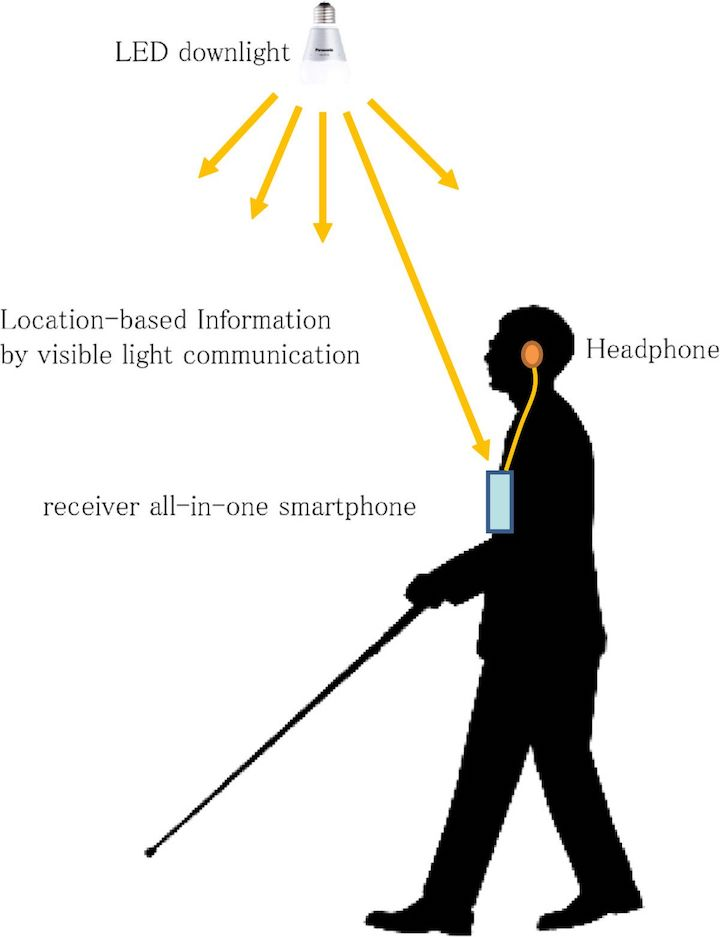

# Project-Team-30

Student Names: Sharwari Phadnis, Akash Alurkar, Aniket Deshpande, Rajas Tulpule

Project Title :
**Lumino: Location Based Data Ingestion using Li-Fi**   - APPROVED
comment: which use case will you use to demonstrate this technology implementation? Has to be a practical one that is easy to understand and consume. 

Project description

Li-Fi can be considered as a light-based Wi-Fi. It uses light instead of radio waves to transmit information. Li-Fi is transmission of data using illumination i.e. sending data through an LED lamp that varies intensity of light faster than what human eye can perceive. The merits of Li-fi to that of Wi-fi are that High data transmission rates of up to 10Gbps can be achieved, since light cannot penetrate walls, it provides privacy and security that Wi-Fi cannot, Li-Fi has low implementation and maintenance costs and unlike Wi-Fi, Li-Fi emits no radiation.

We propose a system which contains a combination of multiple Light emitting diode and a photovoltaic cell which will be used to transmit and receive data respectively. As Li-Fi works in light spectrum bandwidth is greater and the speeds is much larger. Our proposed system aims to send data such as music(sound), pictures, textual data through the light spectrum.

The applications of the system is best suited for indoor large data hungry establishments like colleges, offices, factories and hospitals. Radio waves do not work underwater, Li-Fi do.

------------------------------------------------------------------------------------------------------------------------------

### **Use Case: Museum Enhanced Experience with Li-Fi**

This use case is specifically aimed to make the museum tour experience more fun and interactive with li-fi for first-time museum goers, children and the elderly to have a superior museum experience. The individual light fixtures at each exhibit deliver information about each individual light exhibit. This positioning grid system with built-in lifi in the light bulbs itself can deliver targeted information to the customer. Here a visitor when visiting a specific exhibit and just point the device at the light source and the audio-visual information about the exhibit is displayed on his device which he rented from the museum. The beauty of this technology is that it will replace the old and drab existing devices to deliver knowledge in the museum. This technology can also be gelled with the new emerging ‘Augmented Reality Museums’2 popping up in the world Using lifi in this use case can provide an energy efficient method for the museums to deliver information right at the user’s fingertips making museum visit a simple, approachable and fun experience rather than just listening to the information.

Here John a visitor rents a device enabled with lifi receiver at the start of the museums. At every exhibit eg ‘Pharohs of Egypt,’ the lights above will be transmitting a recorded information about the exhibit. Now John will just point the device at the light source and the data will be received by the device and start playing the clips in Johns earphones. 

			Existing Audio Guide machines in most museums.
			
			
			
			

			Newer Lifi enabled Museums guides 

------------------------------------------------------------------------------------------------------------------------------

### **Use Case: Smart Guide For The Visually Impaired using Li-Fi Technology**

In this Use case we are focussed on a solution for visually impaired people by providing an Audio guide to assist them 
while walking and navigating from one place to another.

We have leveraged Li-Fi technology to come with a system, that will notify a visually impaired person about the obstacles ahead of them walking in a room enabled with Li-Fi enabled lights.

